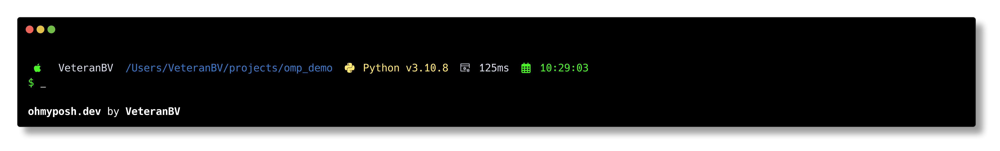

# Retro Legends Transient OMP Theme

This is my Oh My Posh theme inspired by classic computing history. I wanted to create something that brings back the feel of those amazing vintage terminals while keeping all the modern features I use daily.

## About the Theme

I built this theme around colors that remind me of classic machines - the greens from VT100 phosphor displays, blues from the IBM 3278, and that perfect amber warning color from the Wyse 60. I really love how these old terminals looked, and I wanted to bring some of that feeling to my daily development setup.

If you're into the color scheme, I also made a matching terminal theme you might like: [RetroLegends Terminal Theme](https://github.com/veteranbv/RetroLegends)

## Features

### Prompt Segments

- OS icons that adapt to your system
- Username and current directory info
- Status indicators for various programming languages:
  - Python (shows virtual environments too)
  - Node.js (with npm/yarn detection)
  - Rust
  - Go
  - Java
  - .NET
  - Dart
  - Angular
  - Ruby

### Git Info

- Shows branch status with icons
- Working and staging status
- Stash count
- Upstream status
- Color-coded changes using those classic terminal colors

### Other Cool Stuff

- Command execution time
- Timestamp
- Root user warnings
- Exit status colors
- Virtual environment detection
- Clickable paths
- Transient prompt to keep things clean

## Why I Made This

I've always been fascinated by classic computers and terminals, and I spend a lot of time in my terminal. This theme is my way of bringing together that vintage computing aesthetic I love with all the modern features I need for development. The transient prompt keeps things clean, but you still get all the info you need when you need it.
